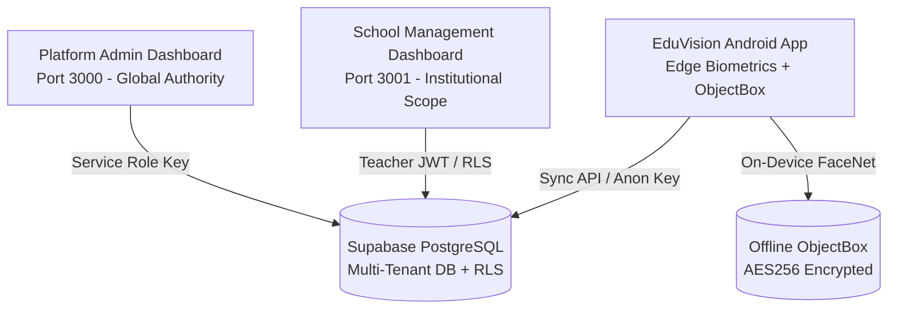
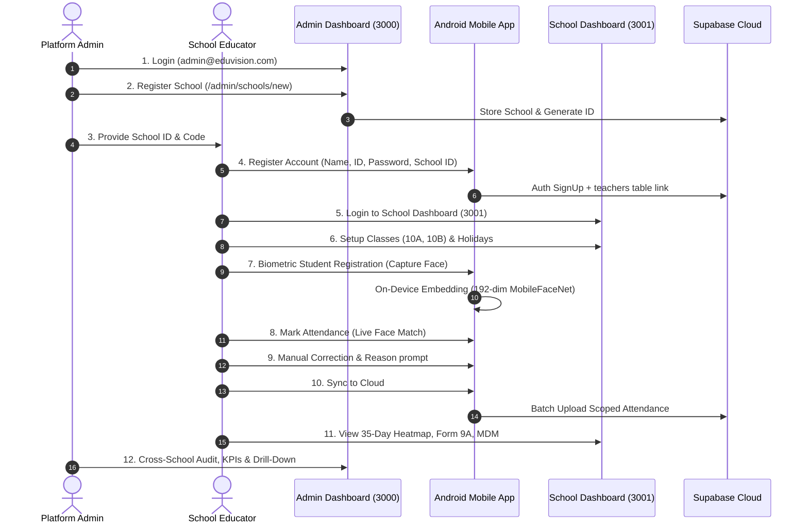

# EduVision — End-to-End Workflow Testing Guide

> **Target Audience**: Co-developers, QA engineers, and system evaluators  
> **Repository**: [https://github.com/Vigneshnandan/EduVision](https://github.com/Vigneshnandan/EduVision)  
> **Branch**: `feature/track-a-b-rollout`  
> **Last Updated**: September 2026

---

## Table of Contents

1. [Architecture & System Overview](#1-architecture--system-overview)
2. [Prerequisites & System Requirements](#2-prerequisites--system-requirements)
3. [Step 1: Clone Repository & Checkout Branch](#step-1-clone-repository--checkout-branch)
4. [Step 2: Environment Variables Configuration & Admin Provisioning](#step-2-environment-variables-configuration)
   - [2.4 Platform Administrator Provisioning](#24-platform-administrator-provisioning-supabase-sql)
   - [2.5 Database Migrations & Security Hardening](#25-database-migrations--security-hardening-supabase-sql)
5. [Step 3: Running Both Web Dashboards Locally](#step-3-running-both-web-dashboards-locally)
6. [Step 4: Building & Installing the Android APK](#step-4-building--installing-the-android-apk)
7. [Step 5: End-to-End Workflow Testing Guide](#step-5-end-to-end-workflow-testing-guide)
   - [Phase A: Admin Dashboard — Register a New School](#phase-a-admin-dashboard--register-a-new-school)
   - [Phase B: Mobile App — Teacher Onboarding & Session Auth](#phase-b-mobile-app--teacher-onboarding--session-auth)
   - [Phase C: School Dashboard — Setup Classes & Calendar](#phase-c-school-dashboard--setup-classes--calendar)
   - [Phase D: Mobile App — Biometric Face Enrollment](#phase-d-mobile-app--biometric-face-enrollment)
   - [Phase E: Mobile App — Live Attendance & Manual Correction](#phase-e-mobile-app--live-attendance--manual-correction)
   - [Phase F: Mobile App — Cloud Sync with Supabase](#phase-f-mobile-app--cloud-sync-with-supabase)
   - [Phase G: School Dashboard — Post-Sync Exploration](#phase-g-school-dashboard--post-sync-exploration)
   - [Phase H: Admin Dashboard — Platform Oversight & Compliance](#phase-h-admin-dashboard--platform-oversight--compliance)
8. [Troubleshooting & FAQs](#8-troubleshooting--faqs)

---

## 1. Architecture & System Overview

EduVision is a multi-tier, multi-tenant biometric attendance and educational compliance ecosystem composed of three interoperating components:



| Component | Tech Stack | Local Port / Runtime | Purpose |
|---|---|---|---|
| **Admin Dashboard** | Next.js 16 (App Router), TypeScript, Tailwind CSS, Recharts | `http://localhost:3000` | Platform-wide KPIs, school onboarding, tier plans (Free/Paid), cross-school audit logs, DSAR privacy exports. |
| **School Dashboard** | Next.js 16 (App Router), TypeScript, Tailwind CSS, Lucide | `http://localhost:3001` | Institutional portal: Class rosters, 35-day attendance heatmaps, Form 9A register (PDF/CSV), Mid-Day Meal (MDM) calculation, at-risk flags. |
| **Android App** | Kotlin, Jetpack Compose, CameraX, MediaPipe/MLKit, MobileFaceNet, ObjectBox | Android 8.0+ (API 26+) | Edge face recognition, zero-latency offline attendance marking, manual override with reason audit, encrypted session store, cloud sync. |
| **Cloud Backend** | Supabase (PostgreSQL 15, Auth, RLS, Storage) | Cloud Hosted | Multi-tenant database with strict Row-Level Security isolating schools. |

---

## 2. Prerequisites & System Requirements

Before starting, ensure your development machine has the following tools installed:

- **Node.js**: `v18.17.0` or higher (`v20.x` LTS recommended)
- **Package Manager**: `npm` (v9+)
- **Git**: `2.30+`
- **Java Development Kit (JDK)**: JDK 17 (Eclipse Temurin or OpenJDK 17)
- **Android Studio**: Ladybug, Hedgehog, or newer (with Android SDK 34 platform & build-tools)
- **Physical Android Device** (recommended for camera face testing) or **Android Emulator** (configured with webcam / virtual camera scene). Minimum Android 8.0 (API Level 26).

---

## Step 1: Clone Repository & Checkout Branch

Open your terminal (PowerShell, Command Prompt, or Bash) and clone the repository:

```bash
# 1. Clone the repository
git clone https://github.com/Vigneshnandan/EduVision.git

# 2. Enter project root directory
cd EduVision

# 3. Check out the feature/track-a-b-rollout branch
git checkout feature/track-a-b-rollout

# 4. Verify branch state
git status
```

---

## Step 2: Environment Variables Configuration

The project uses a unified Supabase cloud database. You must configure three configuration files:

### 2.1 Admin Dashboard (`admin-dashboard/.env.local`)

Navigate to `admin-dashboard` and create `.env.local`:

```bash
cd admin-dashboard
copy .env.example .env.local   # On Windows PowerShell / CMD
# or: cp .env.example .env.local on Linux/macOS
```

Ensure `admin-dashboard/.env.local` contains:

```env
NEXT_PUBLIC_SUPABASE_URL=https://your-project.supabase.co
NEXT_PUBLIC_SUPABASE_ANON_KEY=your-supabase-anon-key

# Service Role Key enables platform admins to query across schools & manage platform audits:
SUPABASE_SERVICE_ROLE_KEY=your-supabase-service-role-key
```

> **Security & Reliability Note**: `SUPABASE_SERVICE_ROLE_KEY` is strictly required for the Admin Dashboard. If this key is missing from `.env.local` or deployment settings:
> - A prominent **Amber Alert Banner** will display across the top of the Admin Dashboard.
> - Administrative write actions (e.g. school registration, teacher status changes) and audit logging will **fail loudly with a descriptive exception** rather than silently degrading to the unprivileged anon key.

### 2.2 School Dashboard (`school-dashboard/.env.local`)

Navigate to `school-dashboard` and create `.env.local`:

```bash
cd ../school-dashboard
copy .env.example .env.local   # On Windows
```

Ensure `school-dashboard/.env.local` contains:

```env
NEXT_PUBLIC_SUPABASE_URL=https://your-project.supabase.co
NEXT_PUBLIC_SUPABASE_ANON_KEY=your-supabase-anon-key
```

### 2.3 Android App (`local.properties`)

Navigate to the Android project folder:

```bash
cd ../Vish-EduVision(1.2.26)-v2/OnDevice-Face-Recognition-Android
```

Create or edit `local.properties`:

```properties
## EduVision Android Configuration
sdk.dir=C:\\Users\\YOUR_USERNAME\\AppData\\Local\\Android\\Sdk

# Supabase Credentials (injected into BuildConfig during Gradle compilation)
SUPABASE_URL=https://your-project.supabase.co
SUPABASE_ANON_KEY=your-supabase-anon-key
```

> **Note on Windows paths**: In `local.properties`, backslashes in `sdk.dir` must be escaped with double backslashes `\\` or use forward slashes `/`.

### 2.4 Platform Administrator Provisioning (Supabase SQL)

Platform administration requires an account in `auth.users` and a corresponding authorization record in `public.platform_admins`.

To provision the default master admin account (`admin@eduvision.com` / `AdminPassword123!`), open the **Supabase Dashboard > SQL Editor** and execute:

```sql
DO $$
DECLARE
    admin_uid UUID;
BEGIN
    -- 1. Check if user already exists in auth.users
    SELECT id INTO admin_uid FROM auth.users WHERE email = 'admin@eduvision.com';

    -- 2. Create the auth user if not present
    IF admin_uid IS NULL THEN
        admin_uid := gen_random_uuid();
        INSERT INTO auth.users (
            instance_id,
            id,
            aud,
            role,
            email,
            encrypted_password,
            email_confirmed_at,
            raw_app_meta_data,
            raw_user_meta_data,
            created_at,
            updated_at
        ) VALUES (
            '00000000-0000-0000-0000-000000000000',
            admin_uid,
            'authenticated',
            'authenticated',
            'admin@eduvision.com',
            crypt('AdminPassword123!', gen_salt('bf')),
            now(),
            '{"provider":"email","providers":["email"]}',
            '{"role":"platform_admin"}',
            now(),
            now()
        );
    END IF;

    -- 3. Grant platform_admin authorization
    INSERT INTO public.platform_admins (auth_user_id, full_name)
    VALUES (admin_uid, 'Platform Master Admin')
    ON CONFLICT DO NOTHING;
END $$;
```

### 2.5 Database Migrations & Security Hardening (Supabase SQL)

Both dashboards maintain a 100% synchronized schema history located in:
- `admin-dashboard/supabase/migrations/`
- `school-dashboard/supabase/migrations/`

#### Core Schema Facts:
- **`schools.school_id`**: Stored as **`BIGINT`** (auto-incrementing integer identity, e.g., `1`, `2`, `42`). Foreign keys in `teachers`, `classes`, `school_holidays`, and `mdm_daily_registers` are also `BIGINT`.
- **`attendance.school_id` & `student_details.school_id`**: Stored as **`TEXT`** to accept mobile payloads from the Android face recognition client.
- **Unified Tenant Isolation**: `public.current_teacher_school_id()` returns `TEXT` and all policies compare using `school_id::text = public.current_teacher_school_id()`, eliminating Postgres type mismatch errors between `BIGINT` and `TEXT`.

#### Recommended: Apply Security Hardening Migration
Before testing, execute [`20260927000000_tighten_schools_and_teachers_rls.sql`](file:///e:/Vishal-Project/Technova/EduVision/admin-dashboard/supabase/migrations/20260927000000_tighten_schools_and_teachers_rls.sql) in your **Supabase Dashboard > SQL Editor**:
1. **Teacher Role Enforcement**: Creates `public.is_school_admin()` security-definer helper, enforcing that only active school administrators can invite colleagues, modify roles, or toggle teacher status.
2. **Directory Privacy**: Strips public anonymous access from sensitive `schools` fields (contact email/phone, status, plan tier), exposing only basic directory information (`school_id`, `school_name`, `school_code`, `address`) for dropdown search.
3. **Defense-in-Depth Server Actions**: `school-dashboard` server actions actively verify admin privileges in the database rather than relying solely on UI button state.

---

## Step 3: Running Both Web Dashboards Locally

To test the multi-tenant workflow simultaneously, run both dashboards in separate terminal windows on different ports.

### Terminal 1: Admin Dashboard (Port 3000)

```bash
cd EduVision/admin-dashboard
npm install
npm run dev
```

- Accessible at: **`http://localhost:3000`**
- **Default Master Admin Credentials**:
  - Email: `admin@eduvision.com`
  - Password: `AdminPassword123!`

### Terminal 2: School Dashboard (Port 3001)

Open a new terminal window:

```bash
cd EduVision/school-dashboard
npm install
npm run dev -- -p 3001
```

- Accessible at: **`http://localhost:3001`**
- Teacher credentials will be created during Phase A/B below.

---

## Step 4: Building & Installing the Android APK

You can build the APK locally via command line or Android Studio:

### Option A: Command Line Build (Gradle)

From the Android project directory:

```bash
cd EduVision/Vish-EduVision(1.2.26)-v2/OnDevice-Face-Recognition-Android

# Windows
.\gradlew.bat assembleDebug

# Linux / macOS
chmod +x gradlew
./gradlew assembleDebug
```

Once built, your debug APK will be located at:
`app/build/outputs/apk/debug/app-debug.apk`

Install directly to a connected USB device:
```bash
adb install -r app/build/outputs/apk/debug/app-debug.apk
```

### Option B: Android Studio Setup

1. Open **Android Studio**.
2. Select **Open** and select `EduVision/Vish-EduVision(1.2.26)-v2/OnDevice-Face-Recognition-Android`.
3. Wait for Gradle sync to complete.
4. Select your connected device or emulator in the device selector toolbar.
5. Click **Run 'app'** (Shift + F10).

> **Camera Note for Emulators**: If running on the Android Emulator, go to **Settings > Camera** in the emulator controls and set `Back Camera` to `Webcam0` or `VirtualScene` so the face detection model receives live video frames.

---

## Step 5: End-to-End Workflow Testing Guide

Follow this sequence to test the entire lifecycle from school registration to cloud synchronization and administrative inspection.



---

### Phase A: Admin Dashboard — Register a New School

1. Open your browser and navigate to **`http://localhost:3000/login`**.
2. Sign in with the master admin credentials:
   - **Email**: `admin@eduvision.com`
   - **Password**: `AdminPassword123!`
3. You will be redirected to the **Platform Command Center (`/admin`)**.
4. In the left navigation, click **Institutions** (`/admin/schools`).
5. Click **+ Register School** (top-right button, leading to `/admin/schools/new`).
6. Fill in the institutional registration form:
   - **School Name**: `Greenwood International Academy`
   - **School Code**: `GIA-01`
   - **Official Email**: `contact@greenwood.edu`
   - **Phone**: `+91 98765 43210`
   - **Address**: `124 MG Road, Bangalore, Karnataka`
   - **Subscription Tier**: Select **Paid** or **Free** (select `Paid` to unlock MDM export capabilities).
7. Click **Create Institution**.
8. You will be redirected back to the school directory. Locate your new school and **click on it to view details**.
9. **CRITICAL STEP**: Copy the **School ID** displayed on the school detail page (e.g., `1` or `2`). You will use this numeric ID to bind the mobile app and teacher account.

---

### Phase B: Mobile App — Teacher Onboarding & Session Auth

1. Launch the **EduVision App** on your Android device or emulator.
2. If this is the first launch, the app displays the **Sign In** screen.
3. Tap **"Don't have an account? Register"** at the bottom to open `RegisterScreen`.
4. Enter the teacher credentials:
   - **Full Name**: `Ananya Sharma`
   - **Teacher ID / Email**: `ananya@greenwood.edu` *(or simply `ananya.sharma`)*
   - **Password**: `TeacherPass123!`
   - **School ID**: Enter the **School ID** (e.g., `1`) copied from Admin Dashboard in Phase A.
   - **School Name**: `Greenwood International Academy`
5. Tap **Register**.
6. The app registers the teacher with Supabase Auth, links them to the school via `teachers` table metadata, and saves the session securely in `EncryptedSharedPreferences` (AES256-GCM).
7. **Verify Session Persistence**:
   - Close the app completely from recent tasks and reopen it.
   - The app should automatically bypass the login screen and land directly on **EduVision Home Screen**.

---

### Phase C: School Dashboard — Setup Classes & Calendar

1. Open a new browser tab and navigate to **`http://localhost:3001/login`**.
2. Sign in with the teacher credentials you just registered:
   - **Email**: `ananya@greenwood.edu` *(Note: if you used a username without `@`, Supabase normalizes it to `username@eduvision.school`)*
   - **Password**: `TeacherPass123!`
3. You will land on the **Institutional Overview** scoped strictly to `Greenwood International Academy`.
4. In the sidebar, navigate to **Classes & Sections** (`/classes`):
   - Click **+ Add Class**.
   - Class Name: `Grade 10-A`
   - Assign Teacher: `Ananya Sharma`
   - Click **Save**.
   - Add a second class: `Grade 10-B`.
5. In the sidebar, navigate to **Academic Calendar** (`/calendar`):
   - Click on an upcoming date to declare a **School Holiday** (e.g., "Founder's Day").
   - Observe how the working day calendar dynamically recalculates expected instructional days.

---

### Phase D: Mobile App — Biometric Face Enrollment

Now return to your Android device to register students with biometric facial vectors:

1. On the app's **Home Screen**, tap the **"Student Registration"** action card.
2. Confirm the administrative enrollment prompt ("Continue to Registration").
3. Fill in student details:
   - **Student Full Name**: `Aarav Verma`
   - **Class**: `Grade 10-A`
   - **Roll Number / Student ID**: `101`
4. **Face Capture**:
   - Align the student's face within the circular HUD guide on screen.
   - When the face is centered with good lighting, tap the **Capture** button.
   - The on-device engine (`MobileFaceNet`) computes a 192-dimensional vector embedding.
   - A success confirmation banner confirms biometric enrollment.
5. Repeat for a second student:
   - **Name**: `Diya Patel`
   - **Class**: `Grade 10-A`
   - **Roll Number**: `102`
6. From the Home Screen, tap **"Student List"** (`FaceListScreen`):
   - Verify both students appear in the roster.
   - Use the **Class filter pill** (`Grade 10-A`) to verify class-based filtering.
   - Use the **Search bar** to search for "Aarav".

---

### Phase E: Mobile App — Live Attendance & Manual Correction

1. On the Home Screen, tap **"Mark Attendance"**.
2. **Select Class**: Choose `Grade 10-A`.
3. The live camera scanner opens:
   - Point the camera at Aarav's face.
   - The green recognition bounding box triggers with name "Aarav Verma" and high confidence score.
4. Tap **"Review Attendance"** to navigate to `AttendanceResultScreen`:
   - Aarav Verma is marked **Present** (Green checkmark).
   - Diya Patel is marked **Absent** (Red cross) because she wasn't scanned.
5. **Test Manual Correction with Audit Reason**:
   - Diya Patel arrived late with an excuse. Tap her card row to toggle her status from Absent to **Present**.
   - Notice the amber **"Manual Override"** indicator appears.
   - A reason dialog prompts for justification:
     - Select or type: `"Late arrival - public transport delay"`
     - Tap **Save Reason**.
6. Tap **"Confirm Attendance"**:
   - The attendance session is committed to the local ObjectBox encrypted database.
   - The app returns to the Home Screen with updated daily KPI cards.

---

### Phase F: Mobile App — Cloud Sync with Supabase

EduVision works 100% offline first. Now push local records to the Supabase cloud:

1. On the Home Screen, tap **"Attendance Records"** (`AttendanceLogScreen`).
2. Observe the **Sync Status Pill** at the top right:
   - It indicates: `Not synced yet` or `Pending cloud sync`.
3. Tap the **"Sync Attendance"** button.
4. The pill switches to a spinning indicator: `Syncing... Please wait`.
5. The `CloudSyncRepository` batches local attendance logs, attaches the teacher's session token and school ID, and performs an idempotent upsert into Supabase `public.attendance`.
6. Once completed, the status pill turns green:  
   `✓ Synced — Last synced Just now`.

---

### Phase G: School Dashboard — Post-Sync Exploration

Switch back to your browser at **`http://localhost:3001`**:

1. **Dashboard Home (`/`)**:
   - Refresh the page. Today's attendance percentage and present counts reflect the synced mobile records immediately.
2. **Student Directory & Attendance Heatmap (`/students`)**:
   - Click **Students** in the sidebar.
   - Verify `Aarav Verma` and `Diya Patel` are displayed.
   - Click on **Diya Patel** to open the student drawer:
     - **Demographics Edit**: Enter Father's name, Category (`OBC`), Emergency Phone, and tap **Save Profile**.
     - **35-Day Attendance Calendar Heatmap**: Inspect the visual heatmap:
       - Today's date is colored **Amber** (signifying a Manual Correction).
       - Hover over or inspect the date to see the audit reason: `"Late arrival - public transport delay"`.
3. **Official Form 9A Monthly Register (`/reports`)**:
   - In the sidebar, click **Form 9A Register**.
   - Select Class `Grade 10-A` and the current month.
   - Review the official grid format with daily student presence marks (`P` / `M` / `A`).
   - Click **Export PDF** to preview/print the compliant government register.
   - Click **Export CSV** to download tabular data for spreadsheet audits.
4. **Mid-Day Meal (MDM) Compliance (`/mdm`)**:
   - Click **MDM Reports** in the sidebar.
   - Review the calculated nutritional meal allocation based on actual verified attendance.
   - For Paid schools, test the **Export MDM Daily Summary** report.
5. **At-Risk Chronic Absenteeism Monitor (`/at-risk`)**:
   - Check if any students with consecutive absences trigger the at-risk threshold banner.
6. **Faculty Management & Role-Gated Actions (`/school/teachers`)**:
   - Navigate to `/school/teachers` to view the school roster.
   - **Role Protection Verification**: Only genuine `school_admin` users (verified at the database RLS level via `public.is_school_admin()` and validated server-side in actions) can invite new teachers, toggle colleague status, or promote users. Regular teachers cannot bypass permissions even by invoking server actions directly.

---

### Phase H: Admin Dashboard — Platform Oversight & Compliance

Switch back to the Admin Dashboard at **`http://localhost:3000`**:

1. **Platform Command Center (`/admin`)**:
   - Real-time KPIs display updated totals: Total Schools (+1), Enrolled Students (+2), Today's Attendance Events (+2).
   - Subscription breakdown shows Free vs Paid distribution.
2. **Master Teacher Directory (`/admin/teachers`)**:
   - Search for `Ananya Sharma` or filter by `Greenwood International Academy`.
   - Test **Deactivate Account**: Toggle the status switch to suspend access. Re-activating restores login privileges.
3. **School Inspector Drill-Down (`/admin/drill-down`)**:
   - In the sidebar, click **School Inspector**.
   - Select `Greenwood International Academy` from the school dropdown.
   - As a central auditor, you can view this school's attendance logs, class breakdown, and enrollment without needing the teacher's personal password.
4. **Security & Audit Logs (`/admin/audit`)**:
   - In the sidebar, click **Audit Trail**.
   - Verify every action is logged with actor details, timestamps, and JSON payloads:
     - `school_created`: Greenwood International Academy
     - `plan_tier_updated`: Free -> Paid
     - `teacher_status_changed`
   - **Guaranteed Audit Integrity**: Audit logging uses the service-role client and will fail loudly with an exception if credentials or the audit table cannot be reached, ensuring no administrative action occurs unrecorded.
5. **Data Privacy Tooling & Right-to-Erasure (`/admin/schools/[id]`)**:
   - Go to **Institutions** -> Click on `Greenwood International Academy`.
   - Under **Compliance & Data Privacy**:
     - Click **Export Full School Archive (JSON)** to test GDPR/DPDP Data Subject Access Request (DSAR) compliance.
     - Review the **Permanent School Purge (Right-to-Erasure)** safeguard modal (DO NOT purge if you still wish to test).

---

## 8. Troubleshooting & FAQs

### Q1: The Admin Dashboard says "Not authorized as platform admin" when logging in.
- **Cause**: Supabase Auth user does not have an entry in the `platform_admins` database table.
- **Fix**: Execute the one-click SQL provisioning script in [Section 2.4](#24-platform-administrator-provisioning-supabase-sql) in your Supabase SQL Editor. This creates or links `admin@eduvision.com` with password `AdminPassword123!` and grants full platform admin authorization.

### Q2: Android Gradle build fails with "SDK location not found".
- **Fix**: Open `Vish-EduVision(1.2.26)-v2/OnDevice-Face-Recognition-Android/local.properties` and verify `sdk.dir` matches your local Android SDK location:
  ```properties
  sdk.dir=C:\\Users\\YOUR_USER\\AppData\\Local\\Android\\Sdk
  ```

### Q3: Attendance sync fails with "Network error / 401 Unauthorized".
- **Fix**:
  1. Confirm your Android device or emulator has active internet access.
  2. Confirm `local.properties` contains the correct `SUPABASE_URL` and `SUPABASE_ANON_KEY`.
  3. Ensure the teacher logged in recently so that their JWT session token is not expired.

### Q4: Port 3000 or 3001 is already in use.
- **Fix**:
  - To kill an existing process on port 3000 in Windows:
    ```powershell
    Get-Process -Id (Get-NetTCPConnection -LocalPort 3000).OwningProcess | Stop-Process -Force
    ```
  - Or run on alternative ports:
    ```bash
    npm run dev -- -p 3002
    ```

### Q5: Camera does not detect faces in Android Emulator.
- **Fix**:
  - Open Emulator Settings (`...` button) -> **Camera**.
  - Set **Front camera** to `Webcam0` (your machine's webcam).
  - Alternatively, choose `VirtualScene` and hold `Alt` + `WASD` keys to navigate the virtual room towards a wall poster with a human face.

---

*EduVision testing workflow is complete. For questions or bug reports, open an issue on [GitHub Issues](https://github.com/Vigneshnandan/EduVision/issues).*
